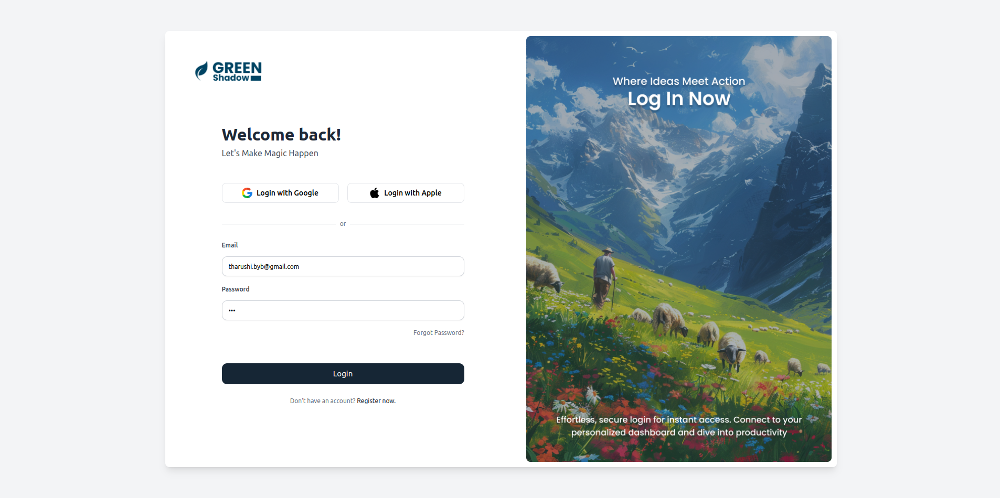
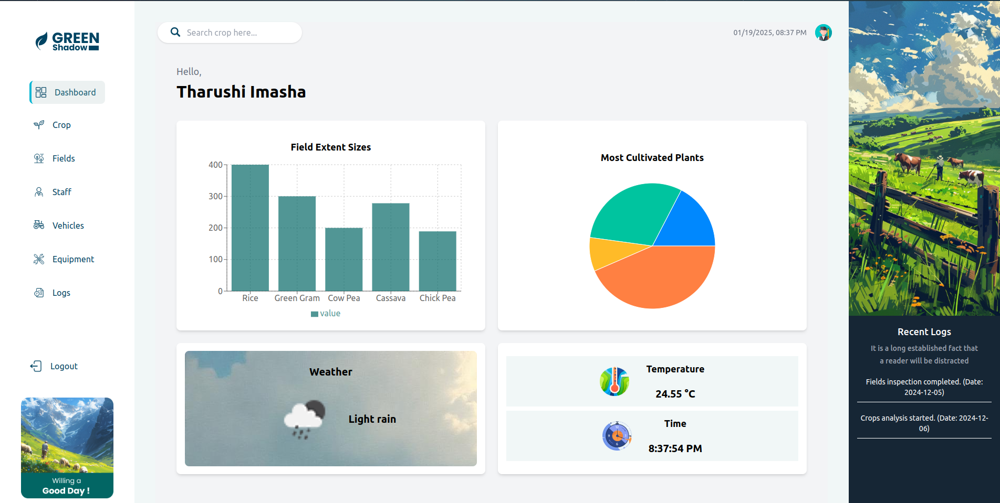
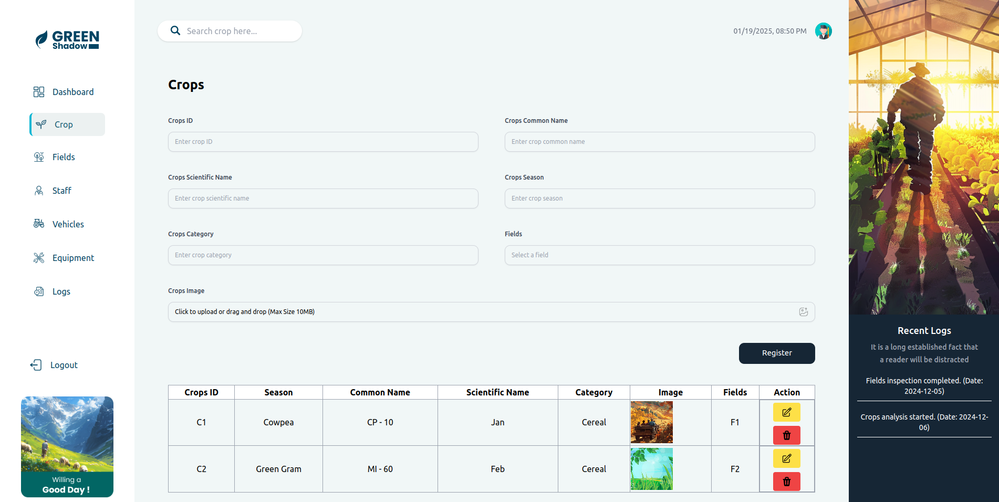
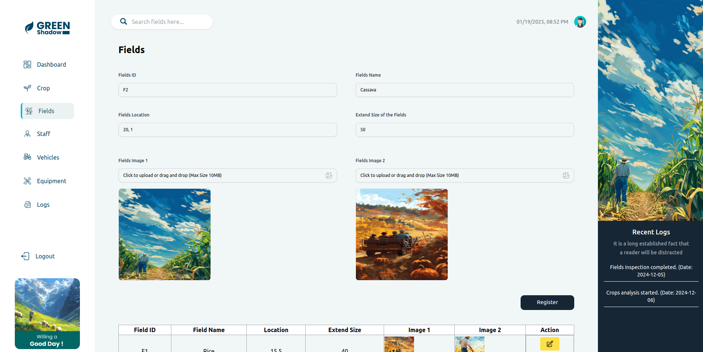

# Crop Monitoring System

This project is a **Crop Monitoring System** built using **React**, **TypeScript**, **Redux**, and **Tailwind CSS**. It uses mock data to demonstrate key functionalities and provides a visually appealing, responsive user interface for monitoring crop details.

## Tech Stack

- **Frontend:** React with TypeScript
- **State Management:** Redux Toolkit
- **Styling:** Tailwind CSS

## Screenshots

### Login View

### Dashboard View

### Crop Details

### Field View

### For more screen shots - https://docs.google.com/document/d/1WHYNv5CrZQxc_LKQVi7L55_4TaOBZkbPkY0IwPyBVH0/edit?usp=sharing